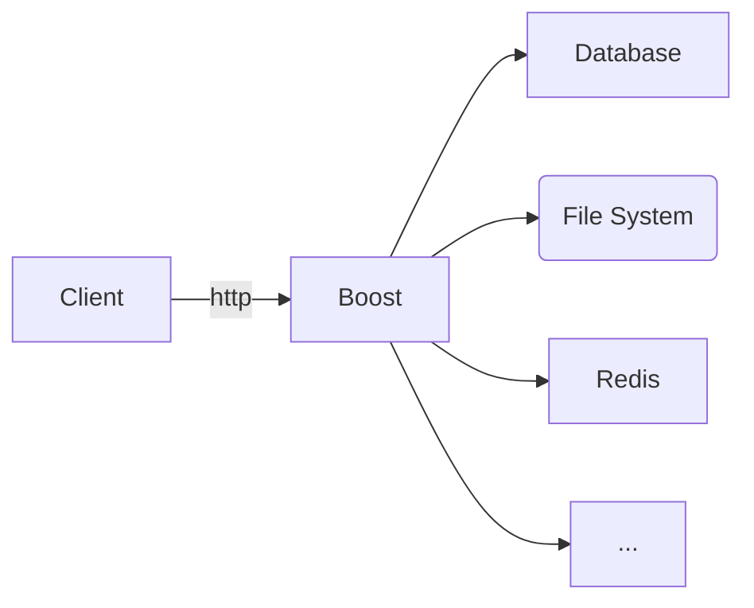
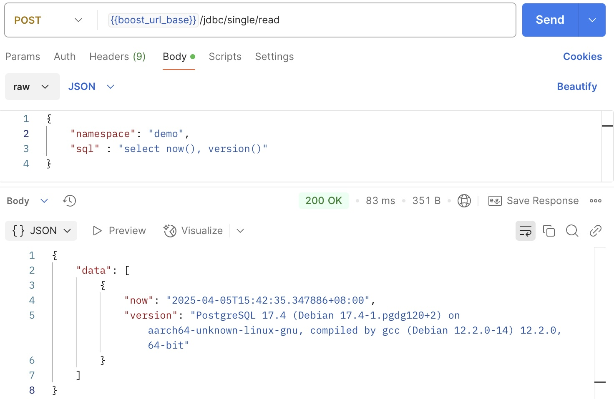

# What does Boost do
Boost is a protocol translator, allowing clients to use HTTP to access various resources, such as databases, file systems and Redis.


# Where can Boost be used
Boost is particularly helpful for integration test. 

Imagine you are developing a simple order management system. The system allows clients to create orders via a RESTful API. Internally it inserts order records into a database table, pushes the records into Redis, and writes logs to the local file system.

While tools like Postman can be used to test the API, they are not sufficient. To thoroughly verify the system's behavior, we need to ensure that records are successfully inserted into the database and Redis, and that the log messages are accurate.

This is where Boost becomes valuable. It provides a set of RESTful APIs that allow clients to verify a system's behavior not only through API responses but also by checking the database, Redis, and file system.

# What resources does Boost support
Boost currently supports accessing the following resources:
- Database (via JDBC)
- Local file system
- Redis

The database supports both read and write operations. This is particularly useful for automating tests, as it allows you to update database records when needed. For example, you might need to update a customer's KYC status during testing, making database write functionality very convenient.

## Examples
### Database



# How to use Boost
Boost is a Spring Boot application that can be started by following these steps:
1. Build project: `./gradlew build`
2. Start application: `./gradlew bootRun`

The application listens on the port 30003.

# The demo
The project includes a demo, which is a simple order management system performing the following tasks:
- Inserts an order record into a database table:
  - If the order amount is greater than 100, the order status is set to "completed".
  - Otherwise, the order status is set to "failed".
- Logs a message to the local file system based on the order status.
- Writes the order record into Redis

## Launch the demo
To run the demo, follow these steps:
- Start local containers
```
docker compose -f infra/local/base.yaml up -d
```

- Import `resources/boost-demo.postman_collection.json` into Postman

- Create an environment in Postman and set the following variables
```
boost_url_base = http://localhost:30003/boost
os_user_home = (your home directory)
```

- Execute the requests in Postman
- Stop local containers after testing is done
```
docker compose -f infra/local/base.yaml down
```

## How does Boost work in the demo
### Create order
```
POST http://localhost:30003/boost/demo/orders
```

request
```json
{
    "namespace": "demo",
    "external_id": "3026197f-c50b-43aa-8dda-c1bb298d6fa1",
    "amount" : "123"
}
```

response
```json
{
    "data": [
        {
            "order_id": "order_1743837986775",
            "status": "completed"
        }
    ]
}
```

### Verify record in the database
```
POST http://localhost:30003/boost/jdbc/single/read
```

request
```json
{
    "namespace": "demo",
    "sql" : "SELECT * FROM orders WHERE external_id = '3026197f-c50b-43aa-8dda-c1bb298d6fa1'"
}
```

response
```json
{
    "data": [
        {
            "id": "order_1743837986775",
            "external_id": "3026197f-c50b-43aa-8dda-c1bb298d6fa1",
            "amount": 123.000000,
            "status": "completed"
        }
    ]
}
```

post-response script
```javascript
const orderId = pm.collectionVariables.get("demo_order_id");
const externalId = pm.collectionVariables.get("demo_order_external_id");

pm.test("completed", function () {
    res = pm.response.json();

    pm.expect(res.data[0].id).to.eql(orderId);
    pm.expect(res.data[0].external_id).to.eql(externalId);
    // verify if order status is expected
    pm.expect(res.data[0].status).to.eql("completed");
});

```

### Verify record in Redis
```
POST http://localhost:30003/boost/string-redis/opsForHash/get
```

request
```json
{
    "namespace": "demo",
    "key": "order:order_1743837986775",
    "hashKey": "order_1743837986775"
}
```

response
```json
{
    "data": [
        {
            "id": "order_1743837986775",
            "status": "completed",
            "amount": 123,
            "external_id": "3026197f-c50b-43aa-8dda-c1bb298d6fa1"
        }
    ]
}
```

post-response script
```javascript
const orderId = pm.collectionVariables.get("demo_order_id");
const externalId = pm.collectionVariables.get("demo_order_external_id");

pm.test("completed", function () {
    res = pm.response.json();

    pm.expect(res.data[0].id).to.eql(orderId);
    pm.expect(res.data[0].external_id).to.eql(externalId);
    // verify if order status is expected
    pm.expect(res.data[0].status).to.eql("completed");
});

```

### Verify log message
```
POST http://localhost:30003/boost/os/file/grep
```

request
```json
{
    "command": "grep \"order completed: 3026197f-c50b-43aa-8dda-c1bb298d6fa1\" /Users/admin/boost-demo.log"
}
```

response
```json
{
    "data": [
        "2025-04-05 15:26:26.793 INFO  [demo] [DEMO    ] [http-nio-30003-exec-2] poc.boost.demo.DemoService - order completed: 3026197f-c50b-43aa-8dda-c1bb298d6fa1, order_1743837986775"
    ]
}
```

post-response script
```javascript
const orderId = pm.collectionVariables.get("demo_order_id");
const externalId = pm.collectionVariables.get("demo_order_external_id");

pm.test("found", function () {
    res = pm.response.json();

    // verify if log message is found
    pm.expect(res.data.length).to.eql(1);
});

```
